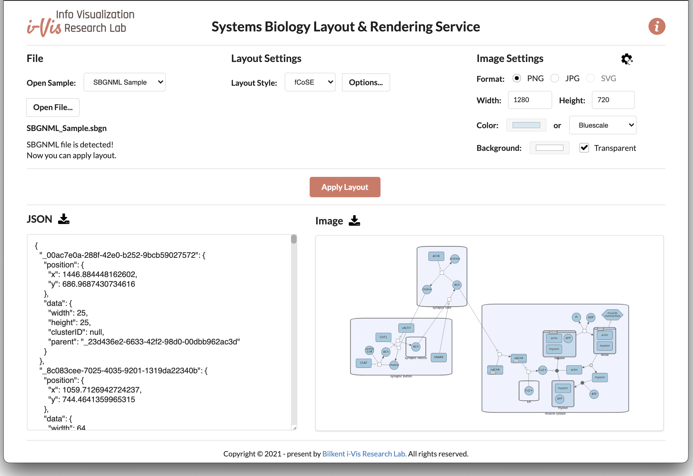

# SyBLaRS

**Sy**stems **B**iology **La**yout & **R**endering **S**ervice (SyBLaRS) is a web service to lay out graphs in SBGNML, SBML, GraphML and JSON formats and/or produce corresponding images (in JPG, PNG or SVG formats) of the layouts in the backend. 



Main use cases of SyBLaRS include:
- creating an image of the provided map, which already has layout information,
- laying out the provided map in specified layout style (among many available ones) and returning the map with layout information, and
- both laying out the provided map in specified layout style and creating an image of it.

SyBLaRS is distributed under the [MIT License](https://github.com/iVis-at-Bilkent/syblars/blob/main/LICENSE).
Here is a sample server deployment along with a simple client-side demo:

<p align="center">
<a href="https://syblars.herokuapp.com"></a>
</p>

## Setup of a service

In order to deploy and run a local instance of the service, please follow the steps below:

### Installation
```
git clone https://github.com/iVis-at-Bilkent/syblars.git
cd syblars
npm install 
```

### Starting server
The default port is 3000, you can change it by setting 'port' environment variable.
```
npm run dev
```
**Note:** This service uses [Puppeteer](https://pptr.dev) to generate the output. Please refer to the [Puppeteer documentation](https://github.com/puppeteer/puppeteer/blob/main/docs/troubleshooting.md#troubleshooting) to ensure that your machine is configured properly to run Chrome headlessly.

## Supported formats
SyBLaRS supports the following input formats for graphs:
[SBGNML](https://github.com/sbgn/sbgn/wiki/SBGN_ML),
[SBML](http://sbml.org/Main_Page),
[GraphML](http://graphml.graphdrawing.org/), and
[JSON](https://www.json.org/).

## Supported layouts
The supported graph layout algorithms are:
[fCoSE](https://github.com/iVis-at-Bilkent/cytoscape.js-fcose/tree/unstable),
[CoLa](https://github.com/cytoscape/cytoscape.js-cola),
[CiSE](https://github.com/iVis-at-Bilkent/cytoscape.js-cise/tree/develop),
[Dagre](https://github.com/cytoscape/cytoscape.js-dagre),
[Klay](https://github.com/cytoscape/cytoscape.js-klay),
[Avsdf](https://github.com/iVis-at-Bilkent/cytoscape.js-avsdf)
and are among Cytoscape.js layout extensions as listed [here](https://js.cytoscape.org/#layouts).

## Usage

Request to layout the graph:
```
POST /layout/:file_format   // file_format: sbgnml, sbml, graphml, json
```
needs to be sent to the server address, and the type of the request must be `text` or `text/plain`.
By default, nodes with their positions *(x, y)* and their dimensions *(width, height)* will be returned. If you want the edges to be returned as well, you should set `edges` option to the request, which is false by default:
```
POST /layout/:file_format?edges=true
```
Request body needs to be formed in the following way:

If the file content is in JSON format:
```
body: JSON.stringfy([JSON.parse(file_content), options])
```
If the file content is in other formats:
```
body: file_content + JSON.stringfy(options)
```
where `options` is an object consisting of `layoutOptions` and `imageOptions`. Example:
```
options = {
  layoutOptions: {
    name: 'fcose',
    nodeDimensionsIncludeLabels: true,
    ...
  },
  imageOptions: {
    format: 'png',              // output format
    background: 'transparent',  // background color
    width: 1280,                // desired width
    height: 720,                // desired height
    color: '#9ecae1'            // node color
  }
}
```

For supported layout options, please check the documentation of the associated layout algorithm. Image options support three output formats: `png`, `jpg` and `svg`. `background` attribute should be a hex color code or `transparent`. `color` attribute should be a hex color code for SBML, GraphML and JSON formats, and one of the following predefined color schemes for the SBGNML format: `bluescale`, `greyscale`, `red_blue`, `green_brown`, `purple_brown`, `purple_green`, `grey_red`, `black_white`.

In case you do not want layout output, you should either not provide `layoutOptions` or provide `preset` layout. If you do not provide `imageOptions`, default ones will be used. To disable image output, you should set `image` option to `false` in request, which is true by default:
```
POST /layout/:file_format?image=false
```

After the request is sent, the server will lay out the given graph and return the layout information in JSON format that contains node ids and their corresponding positions and dimensions and image information (in `base64uri` encoding for `png` and `jpg` formats and in `xml` for the `svg` format).
If an error occurs, the response of the server will consist of the error's body.

For instance, a sample SBGNML file can be laid out with fCoSE layout and a corresponding PNG image can be generated by making a query to the sample deployment of SyBLaRS web service via Fetch API in the following way:
```
let settings = {
  method: 'POST',
  headers: {
    Accept: 'application/json',
    'Content-Type': 'text/plain'
  },
  body: file_content + JSON.stringfy(options)
};

let result = await fetch("https://syblars.herokuapp.com/layout/sbgnml?edges=true", settings)
  .then(response => response.json())
  .then(res => {
    return res;
  })
  .catch(e => {
    return e;
  });
  
let layoutInfo = result["layout"];   // in JSON format
let imageInfo = result["image"];     // in `base64uri` for `png` and`jpg` and in `xml` for `svg`
```
### Notes
- SyBLaRS regards node dimension information in SBML, GraphML and JSON file formats, if it exists. This information should be provided via Layout extension in SBML files, and via `width` and `height` data attributes of each node in GraphML and JSON files (see the [sample files](https://github.com/iVis-at-Bilkent/syblars/tree/main/public/samples)). This is not valid for SBGNML file format, because the third-party [stylesheet](https://github.com/iVis-at-Bilkent/cytoscape-sbgn-stylesheet) we used for SBGNML maps has pre-defined dimensions for each node type.

- SyBLaRS also regards node position information in SBGNML, SBML, GraphML and JSON file formats, if it exists. This is especially useful if you want to create an image of the map you have, which already has layout information. This information should be provided via `bbox` of each glyph in SBGNML files, via Layout extension in SBML files, via `x` and `y` data attributes and `position` attribute of each node in GraphML and JSON files, respectively (see the [sample files](https://github.com/iVis-at-Bilkent/syblars/tree/main/public/samples)).

- Compound graph structures are supported in each file formats. We recomment you to use fCoSE layout algorithm for better results on these types of graphs.

- Clusters are supported only in GraphML and JSON formats. The cluster each node belongs should be defined via `clusterID` data attribute of each node (see the corresponding [sample files](https://github.com/iVis-at-Bilkent/syblars/tree/main/public/samples)). We recommend you to use CiSE layout algorithm for better results on graphs with cluster information.

- The `x` and `y` coordinates of a node in the resulting layout information indicate the '*center*' coordinates of the node.

- `jpg` output format does not support transparent background, therefore it returns a white background when `transparent` option is chosen.

- The layout options presented in the client demo is for display purposes and may not include all options of the corresponding layout. Please refer to the webpage of each layout for the detailed list of options. 

- We run our sample web service and client demo in free Heroku account, therefore it may be in sleep mode and it may take a while (20-30 seconds) for it to wake up in the first query.

## Credits

SyBLaRS is mainly developed based on [Cytoscape.js](https://js.cytoscape.org) and its extensions (see the `package.json` file for a complete listing).

Icons in the client demo are made by [Freepik](http://www.freepik.com) and [Flaticon](https://www.flaticon.com) licensed with 
[Creative Commons BY 3.0](http://creativecommons.org/licenses/by/3.0/).

Third-party libraries used in web service:
[sbgnml-to-cytoscape](https://www.npmjs.com/package/sbgnml-to-cytoscape),
[cytoscape-sbgn-stylesheet](https://github.com/iVis-at-Bilkent/cytoscape-sbgn-stylesheet),
[cytosnap](https://github.com/iVis-at-Bilkent/cytosnap),
[libsbmljs](https://libsbmljs.github.io),
[express](https://www.npmjs.com/package/express),
[cors](https://www.npmjs.com/package/cors),
[jQuery](https://www.npmjs.com/package/jquery),
[jsdom](https://www.npmjs.com/package/jsdom),
[nodemon](https://www.npmjs.com/package/nodemon),
[jest](https://www.npmjs.com/package/jest),
[super-test](https://www.npmjs.com/package/supertest)

Third-party libraries used in client demo:
[Semantic UI](https://semantic-ui.com),
[underscore.js](https://underscorejs.org),
[backbone.js](https://backbonejs.org),
[FileSaver.js](https://github.com/eligrey/FileSaver.js/)

## Team

[Hasan Balci](https://github.com/hasanbalci), [Perman Atayev](https://github.com/PermanAtayev) and [Ugur Dogrusoz](https://github.com/ugurdogrusoz) of [i-Vis at Bilkent University](http://www.cs.bilkent.edu.tr/~ivis)
