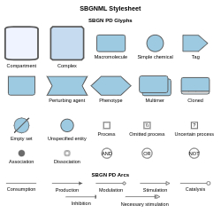
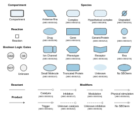
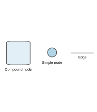

# SyBLaRS

**Sy**stems **B**iology **La**yout & **R**endering **S**ervice (SyBLaRS) is a web service to lay out graphs in SBGNML, SBML, GraphML and JSON formats and/or produce corresponding images (in JPG, PNG or SVG formats) of the layouts with an option to highlight results from various graph queries in the backend. 


Main capabilities of SyBLaRS include:
- creating an image of the provided map, which already has layout information, with an option to highlight a specific query result
- laying out the provided map in specified layout style (among many available ones) and returning the map with layout information in JSON format, and
- both laying out the provided map in specified layout style and creating an image of it again with an option to highlight a specific query result (and returning both the map with layout information and the image).

Backed by these capabilities, SyBLaRS can be used:
- to produce images from a dataset with large amount of graphs (e.g. BioModels) in an automated way (see [test](https://github.com/iVis-at-Bilkent/syblars/tree/test) branch)
- as the layout service of a network visualization tool, and
- to generate image of an SBGN/SBML model for a publication (e.g. journal/conference article).  

SyBLaRS is distributed under the [MIT License](https://github.com/iVis-at-Bilkent/syblars/blob/main/LICENSE).
Here is a sample server deployment along with a simple client-side demo:

<p align="center">
<a href="https://syblars.herokuapp.com"></a>
</p>

## Setup of a service

In order to deploy and run a local instance of the service, please follow the steps below:

### Installation
```
git clone https://github.com/iVis-at-Bilkent/syblars.git
cd syblars
npm install 
```

### Starting server
The default port is 3000, you can change it by setting 'port' environment variable.
```
npm run dev
```
**Note:** This service uses [Puppeteer](https://pptr.dev) to generate the output. Please refer to the [Puppeteer documentation](https://github.com/puppeteer/puppeteer/blob/main/docs/troubleshooting.md#troubleshooting) to ensure that your machine is configured properly to run Chrome headlessly.

## Supported formats
SyBLaRS supports the following input formats for graphs:
[SBGNML](https://github.com/sbgn/sbgn/wiki/SBGN_ML),
[SBML](http://sbml.org/),
[GraphML](http://graphml.graphdrawing.org/), and
[JSON](https://www.json.org/).

The notations used for these formats:

SBGNML Stylesheet            |  SBML Stylesheet |  GraphML & JSON
-------------------------|-------------------------|-------------------------
<a href="https://raw.githubusercontent.com/iVis-at-Bilkent/syblars/main/img/SBGNML_stylesheet.svg" title="SBGNML stylesheet"></a>  |  <a href="https://raw.githubusercontent.com/iVis-at-Bilkent/syblars/main/img/SBML_stylesheet.svg" title="SBML stylesheet"></a> | <a href="https://raw.githubusercontent.com/iVis-at-Bilkent/syblars/main/img/GraphML&JSON_stylesheet.svg" title="GraphML & JSON stylesheet"></a>

## Supported layouts
The supported graph layout algorithms are:
[fCoSE](https://github.com/iVis-at-Bilkent/cytoscape.js-fcose/tree/unstable),
[CoLa](https://github.com/cytoscape/cytoscape.js-cola),
[CiSE](https://github.com/iVis-at-Bilkent/cytoscape.js-cise/tree/develop),
[Dagre](https://github.com/cytoscape/cytoscape.js-dagre),
[Klay](https://github.com/cytoscape/cytoscape.js-klay),
[Avsdf](https://github.com/iVis-at-Bilkent/cytoscape.js-avsdf)
and are among Cytoscape.js layout extensions as listed [here](https://js.cytoscape.org/#layouts).

Each layout style has a varying number of options for customization of the layout. The demo provided only exposes some of the popular options; please refer to the corresponding GitHub repository for an exhaustive list of such options. Among these options some that we think will be commonly used are listed below:
- `padding`: Padding around the map drawing
- `idealEdgeLength`: Ideal length of an edge (layout will try to get every edge this long within constraints)
- `randomize`: Use random node positions at the beginning of layout (`false` means an incremental layout)
- `packComponents`: Whether or not to pack disconnected components after separate layout
- `tile`: Enable tiling of disconnected nodes together for a compact representation
- `nodeDimensionsIncludeLabels`: Whether or not to include labels in node dimensions during layout

## Supported graph queries
The supported graph queries are:
- **Degree Centrality**: The normalized degree centrality of the nodes in the graph
- **Closeness Centrality**: The normalized closeness centrality of the nodes in the graph
- **Betweenness Centrality**: The normalized betweenness centrality of the nodes in the graph
- **Page Rank**: The rank of the nodes in the graph
- **Shortest Path**: The shortest path from a single source to a single target in the graph
- **k-Neighborhood**: The neighbors of the specified source nodes within a certain distance *k*
- **Common Stream**: The set of common nodes that are in the upstream/downstream/bothstream of *all* specified source nodes with a path length limit *k*
- **Paths Between**: The subgraph that consists of the paths of length at most *k* between any two nodes of the specified source nodes
- **Paths From To**: All shortest paths between specified source nodes and target nodes with a maximum length limit *k* and a further distance *d*

For more details about these queries, please refer to [centrality](https://js.cytoscape.org/#collection/centrality) section of Cytoscape.js and [cytoscape.js-graph-algos](https://github.com/iVis-at-Bilkent/cytoscape.js-graph-algos) GitHub repository.

## Usage

Sending request to the local deployment via curl:
```
curl -X POST -H "Content-Type: text/plain" --data "request_body" http://localhost:3000/file_format
```
and via Fetch API
```
let settings = {
  method: 'POST',
  headers: {
    Accept: 'application/json',
    'Content-Type': 'text/plain'
  },
  body: request_body
};

let result = await fetch("http://localhost:3000/file_format", settings)
  .then(response => response.json())
  .then(res => {
    return res;
  })
  .catch(e => {
    return e;
  });
```

where `file_format` is one of the `sbgnml`, `sbml`, `graphml` and `json`.

`request_body`  needs to be formed in the following way:

If the file content is in JSON format:
```
JSON.stringfy([JSON.parse(file_content), options])
```
If the file content is in other formats:
```
file_content + JSON.stringfy(options)
```
where `options` is an object consisting of `layoutOptions`, `imageOptions` and `queryOptions`. Example:
```
options = {
  layoutOptions: {
    name: 'fcose',
    nodeDimensionsIncludeLabels: true,
    ...
  },
  imageOptions: {
    format: 'png',              // output format
    background: 'transparent',  // background color
    width: 1280,                // desired width
    height: 720,                // desired height
    color: '#9ecae1'            // node color
  },
  queryOptions: {
    query: 'kNeighborhood',           // query type
    sourceNodes: [nodeID1, nodeID2],  // source nodes
    limit: 2,                         // path length limit
    direction: 'BOTHSTREAM',          // direction of the search
    sourceColor: '#00ff00',           // highlight color for source nodes
    pathColor: '#ffff00',             // highlight color for result elements
    highlightWidth: 10,               // underlay padding used to highlight elements
    cropToResult: false,              // whether to crop the image to the query result
  }  
}
```
**Note:** While sending the requests via curl, any `"` in the `request_body` should be replaced with `\"`. 

For supported layout options, please check the documentation of the associated layout algorithm. Image options support three output formats: `png`, `jpg` and `svg`. `background` attribute should be a hex color code or `transparent`. `color` attribute should be a hex color code for SBML, GraphML and JSON formats, and one of the following predefined color schemes for the SBGNML format: `bluescale`, `greyscale`, `red_blue`, `green_brown`, `purple_brown`, `purple_green`, `grey_red`, and `black_white`.

The query options change depending on the query type:

Degree Centrality: 
```
  queryOptions: {
    query: 'degreeCentrality',  // query type
    direction: 'DIRECTED',      // direction of the search
    highlight: true,            // whether to highlight nodes based on the resulting values
    highlightColor: '#00ff00'   // highlight color (valid only if highlight option is true)
  } 
```
Closeness Centrality: 
```
  queryOptions: {
    query: 'closenessCentrality',  // query type
    direction: 'DIRECTED',         // direction of the search
    highlight: true,               // whether to highlight nodes based on the resulting values
    highlightColor: '#00ff00'      // highlight color (valid only if highlight option is true)
  } 
```
Betweenness Centrality: 
```
  queryOptions: {
    query: 'betweennessCentrality',  // query type
    direction: 'DIRECTED',           // direction of the search
    highlight: true,                 // whether to highlight nodes based on the resulting values
    highlightColor: '#00ff00'        // highlight color (valid only if highlight option is true)
  } 
```
Page Rank: 
```
  queryOptions: {
    query: 'pageRank',          // query type
    highlight: true,            // whether to highlight nodes based on the resulting values
    highlightColor: '#00ff00'   // highlight color (valid only if highlight option is true)
  } 
```
Shortest Path: 
```
  queryOptions: {
    query: 'shortestPath',   // query type
    sourceNodes: [nodeID1],  // source node - only one node id
    targetNodes: [nodeID2],  // target node - only one node id
    direction: 'DIRECTED',   // direction of the search
    sourceColor: '#00ff00',  // highlight color for source node
    targetColor: '#ff0000',  // highlight color for target node
    pathColor: '#ffff00',    // highlight color for resulting elements
    highlightWidth: 10,      // underlay padding used to highlight elements
    cropToResult: false      // whether to crop the image to the query result
  } 
```
k-Neighborhood: 
```
  queryOptions: {
    query: 'kNeighborhood',                // query type
    sourceNodes: [nodeID1, nodeID2, ...],  // source nodes
    limit: 1,                              // path length limit
    direction: 'BOTHSTREAM',               // direction of the search
    sourceColor: '#00ff00',                // highlight color for source nodes
    pathColor: '#ffff00',                  // highlight color for resulting elements
    highlightWidth: 10,                    // underlay padding used to highlight elements
    cropToResult: false                    // whether to crop the image to the query result
  } 
```
Common Stream: 
```
  queryOptions: {
    query: 'commonStream',                 // query type
    sourceNodes: [nodeID1, nodeID2, ...],  // source nodes
    limit: 1,                              // path length limit
    direction: 'BOTHSTREAM',               // direction of the search
    sourceColor: '#00ff00',                // highlight color for source nodes
    targetColor: '#ff0000',                // highlight color for common nodes in stream    
    pathColor: '#ffff00',                  // highlight color for resulting elements
    highlightWidth: 10,                    // underlay padding used to highlight elements
    cropToResult: false                    // whether to crop the image to the query result
  } 
```
Paths Between: 
```
  queryOptions: {
    query: 'pathsBetween',                 // query type
    sourceNodes: [nodeID1, nodeID2, ...],  // source nodes
    limit: 1,                              // path length limit
    sourceColor: '#00ff00',                // highlight color for source nodes  
    pathColor: '#ffff00',                  // highlight color for resulting elements
    highlightWidth: 10,                    // underlay padding used to highlight elements
    cropToResult: false                    // whether to crop the image to the query result
  } 
```
Paths From To: 
```
  queryOptions: {
    query: 'pathsFromTo',                  // query type
    sourceNodes: [nodeID1, nodeID2, ...],  // source nodes
    targetNodes: [nodeID1, nodeID2, ...],  // target nodes    
    limit: 1,                              // path length limit
    furtherDistance: 1,                    // parameter for "relaxing" the path length limit
    direction: 'DIRECTED',                 // direction of the search
    sourceColor: '#00ff00',                // highlight color for source nodes
    targetColor: '#ff0000',                // highlight color for target nodes    
    pathColor: '#ffff00',                  // highlight color for resulting elements
    highlightWidth: 10,                    // underlay padding used to highlight elements
    cropToResult: false                    // whether to crop the image to the query result
  } 
```
where `direction` is one of `UPSTREAM`, `DOWNSTREAM` or `BOTHSTREAM` for `kNeighborhood` and `commonStream` queries and one of `DIRECTED` or `UNDIRECTED` for `degreeCentrality`, `closenessCentrality`, `betweennessCentrality`, `shortestPath` and `pathsFromTo` queries. 

In case you do not need layout applied, you should either not provide `layoutOptions` or provide `preset` the layout style. If you do not provide `imageOptions`, default ones will be used. To disable image output (in case you only need the output JSON file back with layout information), you should set `image` option to `false` in your request URL, which is `true` by default:
```
http://localhost:3000/file_format?image=false
```

After the request is sent, the server will lay out the given graph and return the layout information in JSON format that will contain node IDs along with their corresponding positions *(x, y)* and dimensions *(width, height)*, and image information (in `base64uri` encoding for `png` and `jpg` formats and in `xml` for the `svg` format). If you want the edges to be returned as well in layout information, you should set edges option to the request URL, which is false by default:
```
http://localhost:3000/file_format?edges=true
```

If an error occurs, the response of the server will consist of an error message.

For instance, a sample SBGNML file can be laid out with fCoSE layout and a corresponding PNG image can be generated by making a query to the sample deployment of SyBLaRS web service via curl in the following way:
```
curl -X POST -H "Content-Type: text/plain" --data "request_body" https://syblars.herokuapp.com/sbgnml?edges=true"
```

and via Fetch API in the following way:
```
let settings = {
  method: 'POST',
  headers: {
    Accept: 'application/json',
    'Content-Type': 'text/plain'
  },
  body: request_body   // file_content + JSON.stringfy(options)
};

let result = await fetch("https://syblars.herokuapp.com/sbgnml?edges=true", settings)
  .then(response => response.json())
  .then(res => {
    return res;
  })
  .catch(e => {
    return e;
  });
  
let layoutInfo = result["layout"];   // in JSON format
let imageInfo = result["image"];     // in `base64uri` for `png` and `jpg` and in `xml` for `svg`
```
### Remarks

- SyBLaRS regards any node position information. This is especially useful if you want to create an image of the map, which is already laid out. This is also useful in cases where you do have a partially decent layout but you would like to apply an incremental layout respecting the current positions in your map. This information should be provided via `bbox` of each glyph in SBGNML files, via the layout extension in SBML files, via `x` and `y` data attributes and `position` attribute of each node in GraphML and JSON files, respectively (see the [sample files](https://github.com/iVis-at-Bilkent/syblars/tree/main/public/samples)).

- SyBLaRS also takes any node dimensions into account for layout in SBML, GraphML and JSON file formats. This information should be provided via the layout extension in SBML files, and via `width` and `height` data attributes of each node in GraphML and JSON files (see the [sample files](https://github.com/iVis-at-Bilkent/syblars/tree/main/public/samples)). Any dimension data is ignored for the SBGNML file format, however, as the third-party [stylesheet](https://github.com/iVis-at-Bilkent/cytoscape-sbgn-stylesheet) used for rendering SBGNML maps has fixed/pre-defined dimensions for each node type.

- Compound/nested graph structures are supported in all file formats. We recommend that you use the [fCoSE](https://github.com/iVis-at-Bilkent/cytoscape.js-fcose) layout style for best results on graphs with compound structures.

- Performing a layout emphasizing the clustering/grouping of nodes is supported only with GraphML and JSON formats. The cluster each node belongs to should be defined via the `clusterID` data attribute of each node (see the corresponding [sample files](https://github.com/iVis-at-Bilkent/syblars/tree/main/public/samples)). [CiSE](https://github.com/iVis-at-Bilkent/cytoscape.js-cise) layout style should be used for layout to explicitly show the clustering available in the graph.

- The `x` and `y` coordinates of a node in the resulting layout information indicate the '*center*' coordinates of the node.

- `jpg` output format does not support transparent background; thus, we return a white background when `transparent` option is chosen.

- The layout options presented in the client demo are not exhaustive and may not include all options of the corresponding layout style. Please refer to the webpage of each layout extension for the detailed list of available options. 

- We run our sample web service and client demo with a free Heroku account. Thus, the application will go in sleep mode and it may take a while (20-30 seconds) for it to wake up before your first request can be served.

## Credits

SyBLaRS uses [the Express framework](https://expressjs.com/) for handling HTTP requests. Actual operations are performed using [Cytoscape.js](https://js.cytoscape.org) and its extensions (see the `package.json` file for a complete listing). Among these extensions, [Cytosnap](https://github.com/cytoscape/cytosnap) is particularly needed for creating a headless Chrome instance, on which graph creation, rendering, layout and image creation of the input graphs are performed.

Icons in the client demo are made by [Freepik](http://www.freepik.com) and [Flaticon](https://www.flaticon.com) licensed with 
[Creative Commons BY 3.0](http://creativecommons.org/licenses/by/3.0/).

Third-party libraries used in web service:
[sbgnml-to-cytoscape](https://www.npmjs.com/package/sbgnml-to-cytoscape),
[cytoscape-sbgn-stylesheet](https://github.com/iVis-at-Bilkent/cytoscape-sbgn-stylesheet),
[cytosnap](https://github.com/iVis-at-Bilkent/cytosnap),
[libsbmljs](https://libsbmljs.github.io),
[express](https://www.npmjs.com/package/express),
[cors](https://www.npmjs.com/package/cors),
[jQuery](https://www.npmjs.com/package/jquery),
[jsdom](https://www.npmjs.com/package/jsdom),
[nodemon](https://www.npmjs.com/package/nodemon),
[jest](https://www.npmjs.com/package/jest),
[super-test](https://www.npmjs.com/package/supertest)

Third-party libraries used in demo client:
[Semantic UI](https://semantic-ui.com),
[underscore.js](https://underscorejs.org),
[backbone.js](https://backbonejs.org),
[FileSaver.js](https://github.com/eligrey/FileSaver.js/)

## Team

[Hasan Balci](https://github.com/hasanbalci), [Ugur Dogrusoz](https://github.com/ugurdogrusoz), [Yusuf Ziya Özgül](https://github.com/YusufZiyaOzgul) and [Perman Atayev](https://github.com/PermanAtayev) of [i-Vis at Bilkent University](http://www.cs.bilkent.edu.tr/~ivis)
